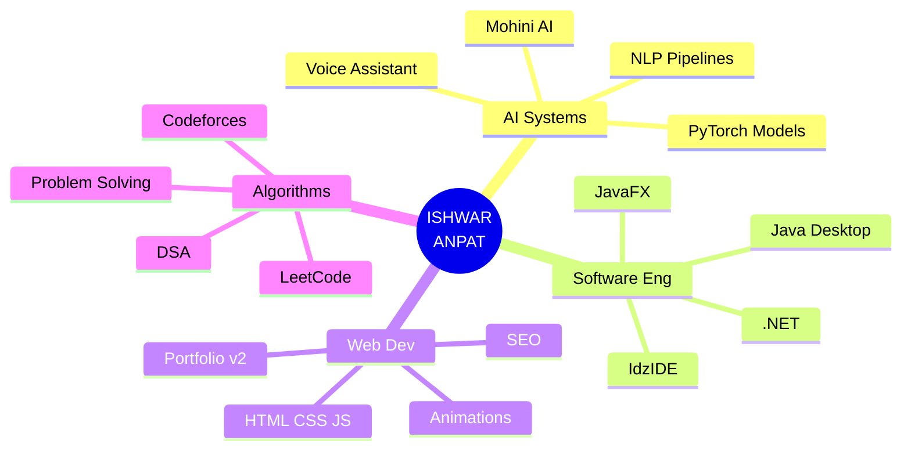

<!-- ██╗███████╗██╗  ██╗██╗    ██╗ █████╗ ██████╗     ░█████╗░███╗   ██╗██████╗  █████╗ ████████╗ -->
<!-- ╚══════════════════════════════════════════════════════════════════════════════════════════════════╝ -->

<div align="center">

</div>

<br/>

<div align="center">

```
╔══════════════════════════════════════════════════════════════════╗
║  ISHWAR-OS v2.0  ·  Kernel: Intelligence-5.26  ·  Arch: Java   ║
║  Status: ACTIVE  ·  Uptime: Since 2024  ·  Load: Maximum 🔥    ║
╚══════════════════════════════════════════════════════════════════╝
```

</div>

<div align="center">

</div>

<br/>

<div align="center">
  
  &nbsp;
  
  &nbsp;
  
</div>

<br/>

```bash
────────────────────────────────────────────────────────────────────
  ISHWAR-OS  /  BOOT LOG  /  2026-07-10 22:41 IST
────────────────────────────────────────────────────────────────────

$ uname -a
  Ishwar_Anpat BSc.CS/2024-2027 Rajarshi-Shahu-Mahavidyalay Latur Maharashtra India

$ cat /etc/identity
  NAME     : Ishwar Anpat
  ALIAS    : ishwar261-oss
  ROLE     : AI & Software Developer
  COLLEGE  : Rajarshi Shahu Mahavidyalay, Latur (2024–2027)
  TIMEZONE : Asia/Kolkata (UTC+5:30)
  STATUS   : [ ✓ AVAILABLE FOR INTERNSHIP & COLLABORATION ]

$ cat /var/log/current_missions.log
  [ACTIVE]   → Mohini AI  ........  voice+text virtual assistant (Java, NLP)
  [ACTIVE]   → IdzIDE  ..........  full Java IDE with custom UI (JavaFX)
  [LEARNING] → LLM Internals  ...  transformers, attention, fine-tuning
  [LEARNING] → Spring Boot  .....  enterprise Java backend architecture
  [ONGOING]  → LeetCode grind  ..  daily DSA problem-solving

$ echo $PHILOSOPHY
  "Every complex problem has a clean, elegant solution. Find it."

────────────────────────────────────────────────────────────────────
```

<br/>

---

<div align="center">

## ⚡ SKILL MATRIX — CPU ALLOCATION

</div>

```
┌─────────────────────────────────────────────────────────────────┐
│  PROCESS              CORE      USAGE     PRIORITY              │
├─────────────────────────────────────────────────────────────────┤
│  Java Development   │ CPU-0  │ ████████████████░░░  88% │ HIGH  │
│  Python / AI-ML     │ CPU-1  │ ████████████████░░░  80% │ HIGH  │
│  Data Structures    │ CPU-2  │ ███████████████░░░░  78% │ HIGH  │
│  Web Dev (HTML/CSS) │ CPU-3  │ ██████████████░░░░░  72% │ MED   │
│  SQL / Databases    │ CPU-4  │ ███████████████░░░░  76% │ MED   │
│  .NET Framework     │ CPU-5  │ ██████████████░░░░░  72% │ MED   │
│  Competitive Prog.  │ CPU-6  │ ████████████░░░░░░░  62% │ GROW  │
│  C Programming      │ CPU-7  │ █████████░░░░░░░░░░  48% │ GROW  │
└─────────────────────────────────────────────────────────────────┘
  Total Capacity Used: ████████████████████ 74.5% avg  ·  8 cores
```

<br/>

---

<div align="center">

## 🔧 TECH STACK — INSTALLED PACKAGES

</div>

<div align="center">

<details>
<summary><b>💻 &nbsp;Languages  [ 7 installed ]</b></summary>
<br/>


</details>

<details>
<summary><b>🤖 &nbsp;AI / ML Stack  [ 4 installed ]</b></summary>
<br/>


</details>

<details>
<summary><b>⚙️ &nbsp;Frameworks & Runtimes  [ 3 installed ]</b></summary>
<br/>


</details>

<details>
<summary><b>🛠️ &nbsp;DevOps & Tools  [ 4 installed ]</b></summary>
<br/>


</details>

</div>

<br/>

---

<div align="center">

## 🚀 ACTIVE PROCESSES — `ps aux | grep ishwar`

</div>

```
USER          PID    %CPU   %MEM   STARTED   STATUS     COMMAND
─────────────────────────────────────────────────────────────────────────────────
ishwar261    1001   88.0   HIGH   2024       [DEPLOYED]  IdzIDE
             │ └── Feature-rich Java IDE · JavaFX · Syntax Highlighting
             │     Custom UI Engine · File Management · Built from scratch
             │     → github.com/ishwar261-oss/IdzIDE

ishwar261    1002   75.0   HIGH   2025       [RUNNING ]  Mohini AI
             │ └── Advanced virtual assistant · Java · NLP · Voice + Text
             │     Event-driven architecture · Natural language processing
             │     → In active development

ishwar261    1003   60.0    MED   2025       [RUNNING ]  Portfolio-v2
             │ └── Personal site · Aurora FX · Particle system
             │     Butterfly cursor · Custom animations · SEO optimized
             │     → ishwar261-oss.github.io

ishwar261    1004   45.0    MED   2026       [INIT    ]  LLM-Research
             └──── Exploring transformer architectures · Attention mechanisms
                   Fine-tuning experiments · Building towards next gen AI
─────────────────────────────────────────────────────────────────────────────────
```

<br/>

---

<div align="center">

## 🌐 NETWORK INTERFACES — `ifconfig --social`

</div>

```
eth0  (Portfolio)   UP  BROADCAST  →  https://ishwar261-oss.github.io
      TX packets: many     RX: projects showcased     STATUS: ✓ LIVE

eth1  (GitHub)      UP  BROADCAST  →  github.com/ishwar261-oss
      TX packets: commits  RX: stars, forks           STATUS: ✓ ACTIVE

eth2  (LinkedIn)    UP  BROADCAST  →  linkedin.com/in/ishwar-anpat-761b6739b
      TX packets: résumé   RX: opportunities          STATUS: ✓ OPEN

eth3  (LeetCode)    UP  BROADCAST  →  leetcode.com/u/Ishwar_Anpat
      TX packets: solves   RX: accepted               STATUS: ✓ GRINDING

eth4  (Codeforces)  UP  BROADCAST  →  codeforces.com/profile/ishwaranpat261-oss
      TX packets: contests RX: rating                 STATUS: ✓ CLIMBING

eth5  (Mail)        UP  BROADCAST  →  ishwaranpat261@gmail.com
      TX packets: offers   RX: collaborations         STATUS: ✓ OPEN
```

<div align="center">

[](https://ishwar261-oss.github.io/)
[](https://github.com/ishwar261-oss)
[](https://www.linkedin.com/in/ishwar-anpat-761b6739b/)
[](https://leetcode.com/u/Ishwar_Anpat/)
[](https://codeforces.com/profile/ishwaranpat261-oss)
[](mailto:ishwaranpat261@gmail.com)

</div>

<br/>

---

<div align="center">

## 🧬 SYSTEM ARCHITECTURE — `cat /etc/brain.map`

</div>



<br/>

---

<div align="center">

## 📊 SYSTEM VITALS — `htop --github`

</div>

<div align="center">


<br/>


</div>

<br/>

---

<div align="center">

## 🐍 COMMIT SNAKE — `git log --graph --all`

<picture>
  <source media="(prefers-color-scheme: dark)" srcset="https://raw.githubusercontent.com/platane/snk/output/github-contribution-grid-snake-dark.svg">
  <source media="(prefers-color-scheme: light)" srcset="https://raw.githubusercontent.com/platane/snk/output/github-contribution-grid-snake.svg">
  
</picture>

</div>

<br/>

---

<div align="center">

## 📡 UPTIME GRAPH — `iostat --contributions`

[](https://github.com/ishwar261-oss)

</div>

<br/>

---

<div align="center">

## 🏆 ACHIEVEMENTS UNLOCKED — `cat ~/.bash_history | grep win`

[](https://github.com/ishwar261-oss)

</div>

<br/>

---

<div align="center">

## ⚔️ ALGORITHM ARENA — Competitive Programming Stats

[](https://leetcode.com/u/Ishwar_Anpat/)

| 🎯 Arena | 🔗 Handle | 🏅 Mission |
|:---:|:---:|:---:|
| **LeetCode** | [Ishwar_Anpat](https://leetcode.com/u/Ishwar_Anpat/) | DSA Mastery |
| **Codeforces** | [ishwaranpat261-oss](https://codeforces.com/profile/ishwaranpat261-oss) | Competitive Climbing |

</div>

<br/>

---

<div align="center">

## 💬 KERNEL MESSAGE

> *"Any fool can write code that a computer can understand.*
> *Good programmers write code that humans can understand."*
> — Martin Fowler


</div>

<br/>

```bash
────────────────────────────────────────────────────────────────────
  ISHWAR-OS  /  SESSION LOG  /  SIGNING OFF
────────────────────────────────────────────────────────────────────

$ shutdown --message "Thanks for visiting"
  [  0.000] Saving session state...
  [  0.100] Flushing commit buffers...
  [  0.200] ⭐ If a repo helped you — a star means the world. 🙏
  [  0.300] Broadcasting: "Let's build something incredible together"
  [  0.400] Terminating all boring code...
  [  0.500] System halt.  ·  See you in the commits.  ·  — Ishwar 🦋

────────────────────────────────────────────────────────────────────
```

<div align="center">

</div>

<!-- 🦋 You found the hidden comment. Just like the butterfly cursor on my portfolio — some magic is meant to be discovered. — Ishwar Anpat -->
